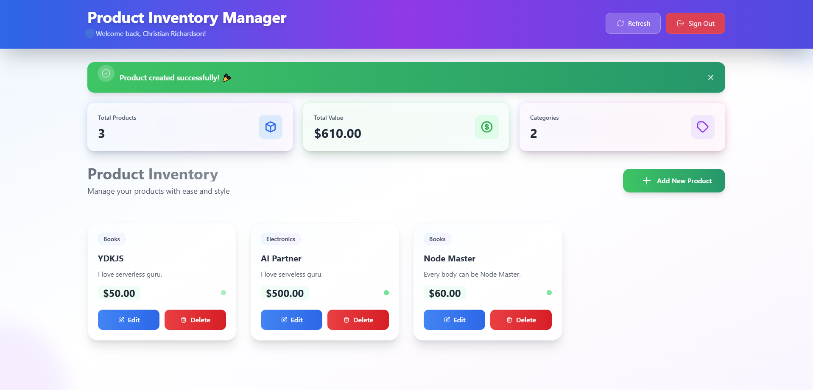
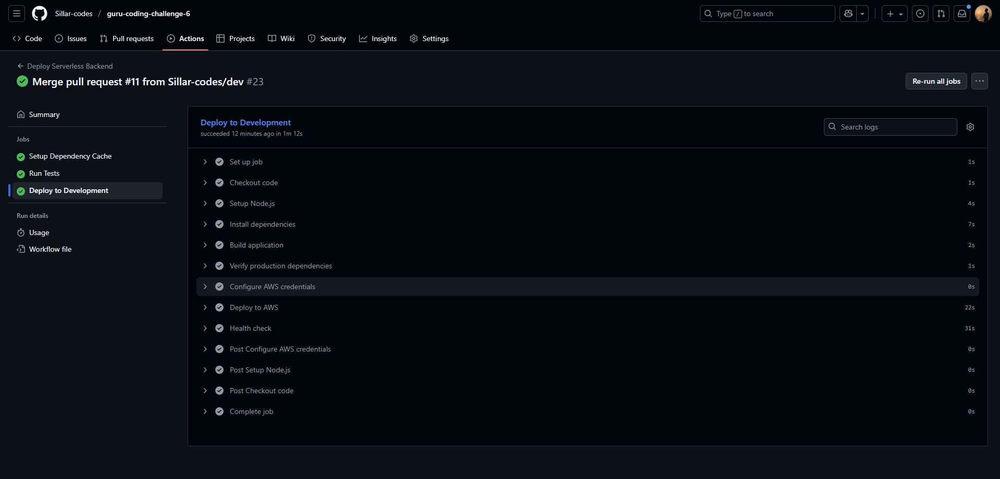

# 🏆 Product Inventory Management

<p align="center">
  
  <br>
  <i>Product Inventory Manager - http://62.72.6.16:3000</i>
</p>

<p align="center">
  
  <br>
  <i>GitHub CI/CD Pipeline</i>
</p>

## 🖥️ Backend: Serverless REST API (AWS)

### 📂 Project Structure

```
backend/
  package.json
  serverless.yml
  tsconfig.json
  webpack.config.js
  scripts/
  src/
    config/
      index.ts
    handlers/
      auth/
        authorizer.ts
        getCurrentUser.ts
        signIn.ts
        signUp.ts
      items/
        all.ts
        create.ts
        delete.ts
        get.ts
        list.ts
        update.ts
    libs/
      apiGateway.ts
      dynamoDB.ts
    types/
      auth.ts
      item.ts
    utils/
      dynamodb.ts
  tests/
```

### 🚀 Tech Stack & Architecture

- **Node.js + TypeScript**
- **Serverless Framework** for Infrastructure as Code (IAC)
- **AWS Lambda** functions for each CRUD operation
- **AWS API Gateway** for RESTful endpoints
- **AWS DynamoDB** for persistent storage
- **AWS Cognito** for secure authentication (sign up, sign in, user management)
- **Multi-stage deployments**: dev & prod environments
- **CI/CD**: Designed for integration with GitHub Actions, AWS CodePipeline, or Serverless Pro CI/CD (auto-deploy on master branch push)
- **YAML organization**: Clean, modular `serverless.yml` with resources, outputs, and function definitions

### 🛠️ Features

- **CRUD Lambdas**:
  - Create, Read (single & all), Update, Delete items
  - No direct API Gateway → DynamoDB proxy; all logic in Lambda
  - Endpoints:<br/>
    GET - https://byit9b38a0.execute-api.us-west-1.amazonaws.com/dev/items/all<br/>
    POST - https://byit9b38a0.execute-api.us-west-1.amazonaws.com/dev/auth/signup<br/>
    POST - https://byit9b38a0.execute-api.us-west-1.amazonaws.com/dev/auth/signin<br/>
    GET - https://byit9b38a0.execute-api.us-west-1.amazonaws.com/dev/auth/me<br/>
    POST - https://byit9b38a0.execute-api.us-west-1.amazonaws.com/dev/items<br/>
    GET - https://byit9b38a0.execute-api.us-west-1.amazonaws.com/dev/items/{id}<br/>
    GET - https://byit9b38a0.execute-api.us-west-1.amazonaws.com/dev/items<br/>
    PUT - https://byit9b38a0.execute-api.us-west-1.amazonaws.com/dev/items/{id}<br/>
    DELETE - https://byit9b38a0.execute-api.us-west-1.amazonaws.com/dev/items/{id}<br/>
- **Authentication**:
  - Cognito User Pool & Client for user management
  - Custom authorizer Lambda for protected routes
- **Automated Infrastructure**:
  - DynamoDB table creation
  - Cognito resources provisioned via IAC
- **Extensible**:
  - Easily add more resources or functions
  - IAM roles scoped for least privilege
- **Testing**:
  - Structure supports unit/integration tests (see `/tests` folder)

### 🧑‍💻 Developer Experience

- **Frequent commits** for traceable progress
- **Documented template** for easy onboarding
- **Video walkthrough** (Loom) for code, IAC, and deployment explanation
- **Optional scripts** for deployment and packaging

---

## 🌐 Frontend: React Application

### 📂 Project Structure

```
frontend/
  public/
    index.html
  src/
    App.tsx
    declarations.d.ts
    index.css
    index.tsx
    material-tailwind.d.ts
    assets/
      svg/
        check.svg
        close.svg
        error.svg
        logout.svg
        refresh.svg
    components/
      Dashboard.tsx
      ItemForm.tsx
      ItemList.tsx
      LoadingSpinner.tsx
      Modal.tsx
      ProductCard.tsx
      SignInForm.tsx
      SignUpForm.tsx
    config/
      index.ts
    contexts/
      AuthContext.tsx
    services/
      api.ts
      auth.ts
    types/
      auth.ts
      item.ts
  eslint.config.js
  package.json
  postcss.config.js
  tailwind.config.js
  tsconfig.json
  webpack.config.js
```

### ⚛️ Tech Stack & Architecture

- **React + TypeScript**
- **Tailwind CSS** for modern, responsive design
- **Webpack** for bundling
- **Context API** for authentication state
- **Service layer** for API communication

### 🎨 Features

- **Full CRUD UI**:
  - Create, Read, Update, Delete items via backend API
- **Authentication**:
  - Sign up, sign in, protected routes (dashboard, item management)
  - Auth context for user state
- **Modern Design**:
  - Tailwind CSS for clean, professional look
  - SVG icons for visual feedback (✔️, ❌, 🔄, etc.)
- **Responsive**:
  - Adapts to 4+ device sizes (mobile, tablet, desktop, large screens)
- **Component-based**:
  - Dashboard, ItemForm, ItemList, Modal, ProductCard, LoadingSpinner, etc.
- **Deployment-ready**:
  - Flexible deployment options (Netlify, Vercel, S3, etc.)
  - Entry point URL to be provided

### 🧑‍💻 Developer Experience

- **TypeScript types** for safety
- **Organized assets** (SVGs, CSS, config)
- **Easy API integration** via service layer
- **Extensible for business cases** (custom item fields, user roles, etc.)

---

## 📦 CI/CD & Automation

- **Multi-stage pipeline**: dev & prod
- **Auto-deploy on master push**
- **Screenshots & documentation** for setup
- **Supports GitHub Actions, AWS CodePipeline, Serverless Pro CI/CD**

---

## 🔒 Security & Best Practices

- **AWS Cognito** for secure user management
- **Protected API routes**
- **IAM roles with least privilege**
- **No direct DynamoDB proxy from API Gateway**

---
